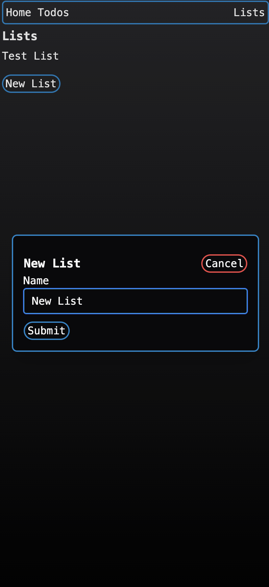
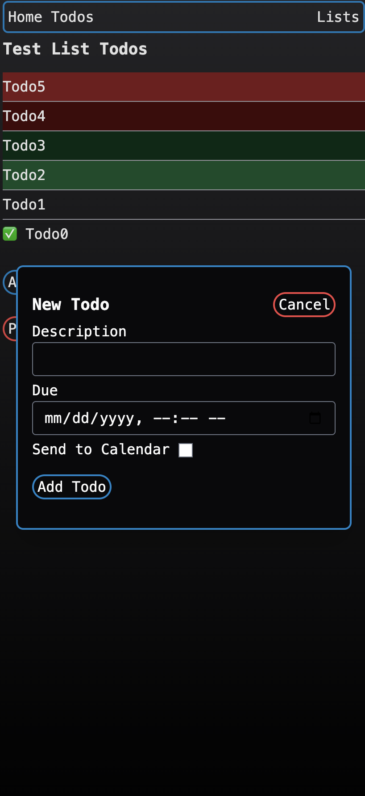
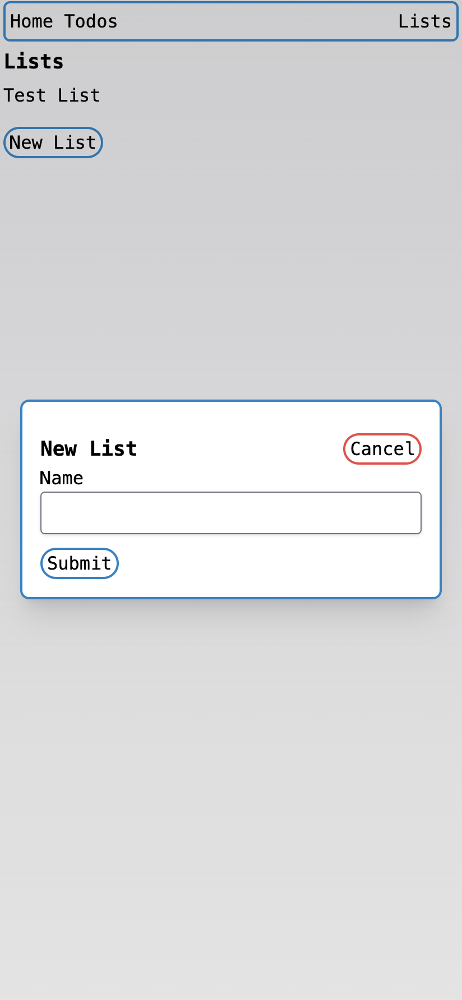
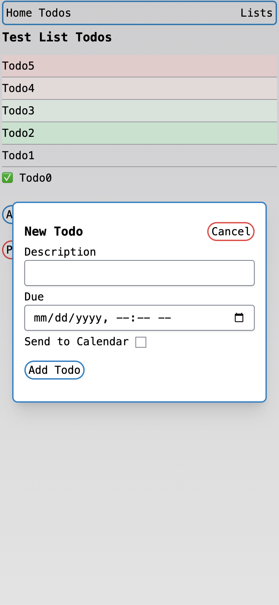

# Home Todo

## Purpose

The purpose of this application is to be a to-do application that runs in a home lab environment. The application can optionally connect to a home_calendar application https://github.com/JavaKoala/home_calendar







## Development Setup

### Install Mysql

https://dev.mysql.com/doc/refman/8.4/en/macos-installation.html

### Install Ruby version 3.3.5

I like rbenv ( https://github.com/rbenv/rbenv ), but rvm works too

### Clone the repository

```
git clone https://github.com/JavaKoala/home_todo.git
```

### Application setup (in the folder with the application)

```
gem install bundler
bundle install
cp config/database.yml.sample config/database.yml
cp config/home_calendar.yml.sample config/home_calendar.yml
```

Update `config/database.yml` to the the local database credentials
Optionally update `config/home_calendar.yml` to enable the send to calendar feature

```
bundle exec rails db:create
bundle exec rails db:migrate
bundle exec rails s
```

go to http://localhost:3000 in a web browser to see the application

Optionally run the delayed jobs in another terminal if send to calendar is enabled:

```
bundle exec rake jobs:work
```

## Docker Build and Run

1. Build image

```
docker build -t home_todo .
```

2. Run image
```
docker run -it --rm --name home_todo -p 3000:3000 \
  -e SECRET_KEY_BASE=<<Your Secret Key Base>> \
  -e DATABASE_URL="mysql2://<<Your User>>:<<Your Password>>@host.docker.internal/home_todo_production" \
  -e RAILS_SERVE_STATIC_FILES=true \
  home_todo
```

### Or with send to calendar enabled

1. Build image

```
docker build -t home_todo .
```

2. Run image with send to calendar enabled

```
docker run -it --rm --name home_todo -p 3000:3000 \
  -e SECRET_KEY_BASE=<<Your Secret Key Base>> \
  -e DATABASE_URL="mysql2://<<Your User>>:<<Your Password>>@host.docker.internal/home_todo_production" \
  -e RAILS_SERVE_STATIC_FILES=true \
  -e HOME_CALENDAR_ENABLED=true \
  -e HOME_CALENDAR_URL="host.docker.internal:3001" \
  home_todo
```

3. Run the `home_calendar` app with the `RAILS_DEVELOPMENT_HOSTS` environment variable

```
RAILS_DEVELOPMENT_HOSTS=host.docker.internal bundle exec rails s -p 3001
```

4. Run the delayed job daemon in the `home_todo` docker container from the docker desktop

```
bin/delayed_job start
```